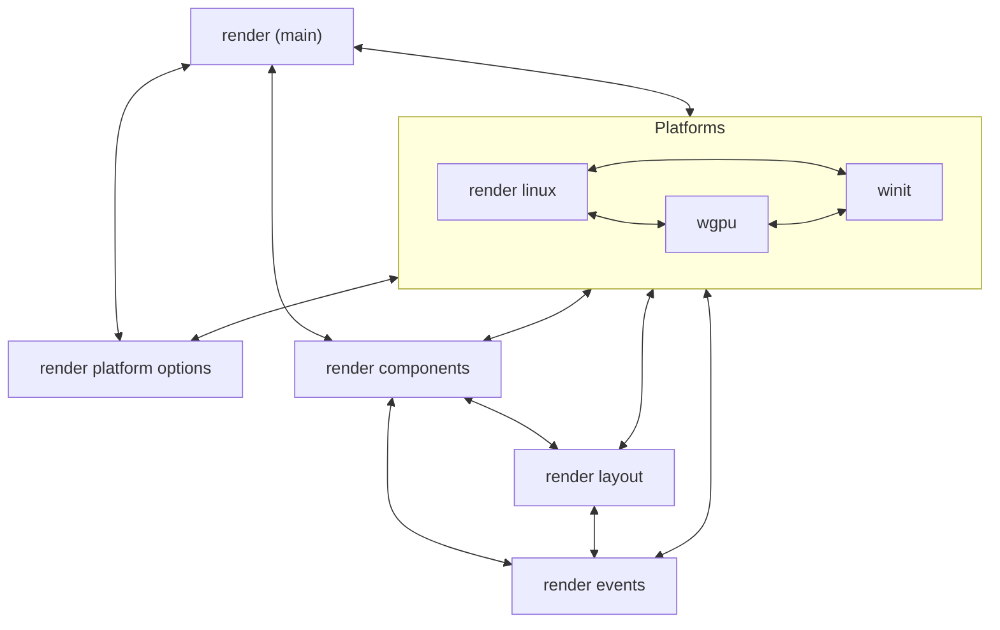

# Crate structure

```mermaid
flowchart TD
    main["render (main)"] <--> platform_opts["render platform options"]
    main <--> components["render components"]
    components <--> events["render events"]
    main <--> Platforms
    subgraph Platforms
        linux["render linux"] <--> winit
        linux <--> wgpu
        wgpu <--> winit
    end
    Platforms <--> events
    Platforms <--> layout
    Platforms <--> platform_opts
    Platforms <--> components
    components <--> layout
    layout <--> events
    layout["render layout"]
```
