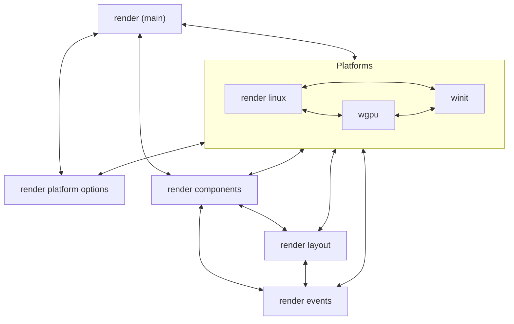
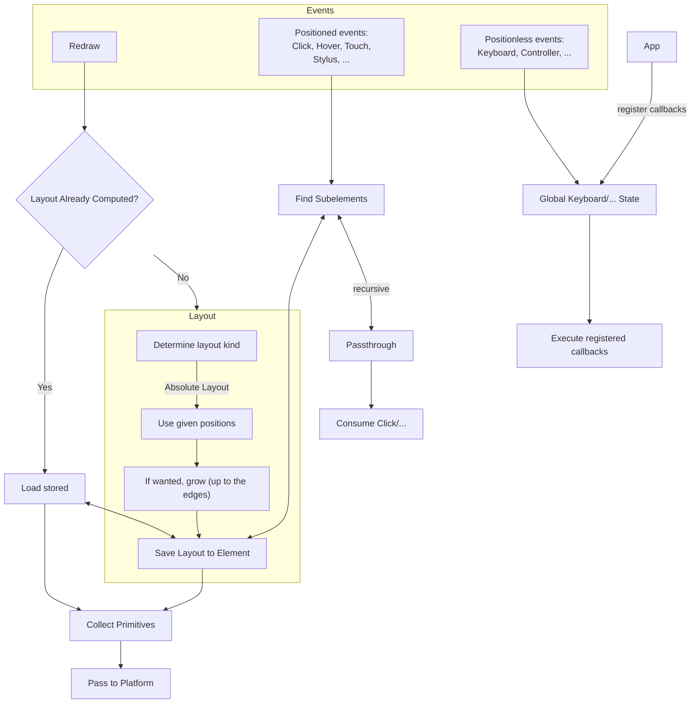

# Crate structure

# Algorithm

Rules for elements:
- It must work no matter which size it is given. The parent is responsible for giving it the right size. If it is too small or too big, it may display a red box to indicate that or error but **never panic**!
- There is no such thing as absolute positioning. If you want something to appear outside the current element, go to the element it should appear in! Send some kind of signal there, like a global boolean flag. If this project grows big enough, a signaling system will be implemented, but for now, just go and do it manually.

